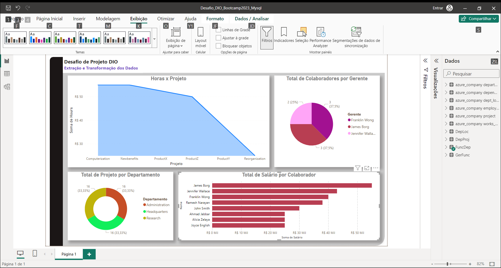

## Processando-e-Transformando-Dados-com-Power-BI
Desafio Bootcamp DIO Power BI

1 - Verificado os cabeçalhos e os tipos de dados das consultas.

2 - Alteração das colunas com valores monetários para o tipo decimal fixo.

3 - Realizado a mescla das consultas Departament e Project e criando uma nova consulta "DepProj" e ajustando os cabeçalhos para nomes mais amigáveis.

4 - Alguns registros da consulta Employees, alguns funcionários não tinham gerente vinculados, foi conversado com o "setor responsável" e foi informado que os neste caso deverá colocar o próprio funcionario.

5 - Foi verificado se os departamentos possuiam gerentes vinculados.

6 - Dados em branco foram preenchidos nas consultas.

7 - Ajustado a coluna de Horas de Projeto.

8 - Realizado a separação da Coluna de endereço e criando as seguintes : Número, Cidade e Estado.

9 - Realizedo a mescla da consulta Employee e Departament.

10 - Colunas desnecessárias excluidas.

11 - Realizado a Mescla das consultas dos Colaboradores e os Gerentes via Power BI.

12 - Realizado a Mescla da Coluna Nome e Sobrenome, para determinar o nome do colaborador.

13 - Realizado a Mescla da consulta Departament e Dept_Locations.

14 - A Mesclagem foi utilizada pois foi necessário combinar dados de diferentes tabelas com base em uma chave ID em comum, assim sendo possível criar uma nova consulta com possuisse a informação das duas colunas utilizadas na mesclagem.

15 - Após a mesclagem, existem 8 colaboradores para 3 gerentes.

16 - A última limpeza nos dados foram realizadas, retirando todas as colunas desnecessárias.

#Grato por ler este relatório

